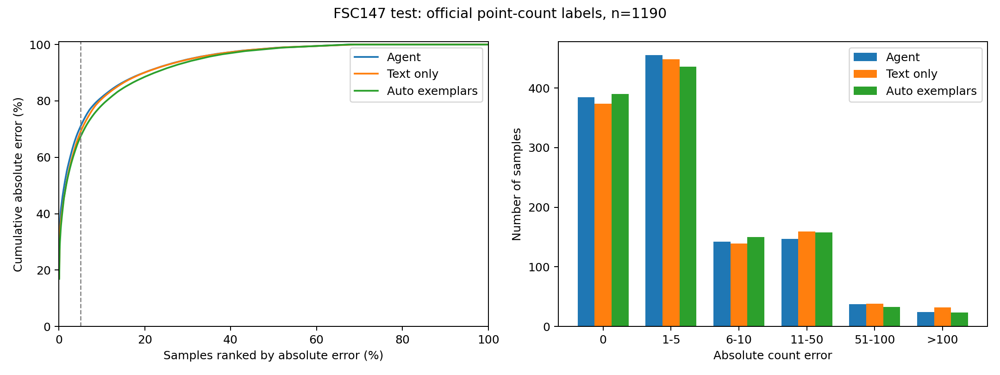

# FSC 计数与 MME 选 E 诊断（2026-10-09）

范围：新数据 64 卡 step80 的现有 agent 结果；FSC 1190 题重新跑 CountGD++ 纯文本与自动示例框。MME 使用已保存的官方规则分数，不使用 API judge。TallyQA 按用户最新要求暂不启动。

## 先修正我们本地的 FSC 标签口径

本地 `scripts/prepare_fsc147_eval.py` 把 FSCD JSON 中所有 annotations 都算成目标，其中含 3 个示例框。1190 张图的标签均比 FSC 官方 `points` 数多 3。这是本地评测数据构建问题，并非官方标注错误。

同一份 agent 预测：历史标签 MAE **15.7723**；官方点数 MAE **15.1891**。本次所有新比较均使用官方点数。没有覆盖历史预测、标签或实验总表。

## FSC 全量工具对照

纯文本只输入类别名。自动示例框由工具第一次预测按置信度取前 3 个，再进行第二次预测；无候选时回退。两组图像、类别、权重和阈值 0.23 相同，不使用真实示例框。直接调用现有生产后端，跳过 agent。

| 方法 | MAE ↓ | RMSE ↓ | 完全正确 | 误差中位数 | P95 | 最大误差 | 最差 5% 误差贡献 |
|---|---:|---:|---:|---:|---:|---:|---:|
| Agent | 15.1891 | 129.3723 | 385/1190 | 2.0 | 51.55 | 3468 | 70.95% |
| Text only | 16.5555 | 129.7812 | 374/1190 | 2.0 | 59.10 | 3462 | 69.02% |
| Auto exemplars | 13.9462 | 100.0877 | 390/1190 | 2.0 | 46.10 | 2801 | 67.31% |

自动示例框使 309 题误差下降、321 题上升、560 题相同；实际启用 1157/1190 次。自动模式第一遍计数与独立纯文本模式不一致 0 题。后端在置信度 token 范围上存在实现差异，因此保留这项核查；该对照评估现有两种工具模式。

自动示例框使 MAE 相对下降 **15.76%**，但不是逐题普遍改善。净减少绝对误差 3105，其中 1560（50.24%）来自两张目标数超过 900 的图：预测分别从 239、1 提高到 900、900，仍然触及工具输出上限。存在明显反例：index 1090 从 269 降到 4，真实值 384。因此后续实验应检验何时启用自动示例框、何时复核，而不能根据平均收益认定每题都可靠。

## Agent 的大误差与工具采信

按绝对误差排序取 ceil(1190×5%)=60 题：贡献总绝对误差 **70.95%**；其余 1130 题 MAE **4.6460**。其中 **48/60** 题最终数字与最后一次计数工具相同，贡献全体误差 **60.63%**（这 60 题误差的 85.45%）。这里的“相同”是可复核的数值一致，不能单凭它证明模型照抄或因果。

1190 题中有 5 个 Excel raw_response 单元格截断；其中 1 题工具列表仍完整，另外 4 题不计入“与最后工具相同”的判定。完整工具列表 1186 题中，有 1137 题最终数字等于最后工具数字。

也不能说 agent 完全不会纠错：在轨迹完整、只对原图调用一次计数且有数值返回的 1181 题中，agent 改动了 45 个工具数字，其中 38 题改善、7 题变差，累计减少绝对误差 1320。该子集工具数值 MAE 15.9797，agent MAE 14.8620。它已有一定纠错能力，但没有处理好贡献最大的异常样本。详见 `fsc_agent_corrections.json`；这与使用固定类别名的独立工具重跑是不同分析。

| index | 类别 | 官方目标数 | Agent | Agent 最后工具 | 纯文本重跑 | 自动示例框重跑 |
|---:|---|---:|---:|---:|---:|---:|
| 561 | marker | 3701 | 233 | 233 | 239 | 900 |
| 979 | yellow lego stud | 2560 | 1 | 1 | 1 | 900 |
| 1046 | lego | 512 | 1 | 0 | 0 | 0 |
| 1171 | marker | 500 | 47 | 47 | 54 | 573 |
| 1090 | lego | 384 | 3 | 275 | 269 | 4 |
| 365 | apple | 223 | 1 | 1 | 0 | 0 |
| 51 | sunglasses | 226 | 410 | 410 | 409 | 409 |
| 474 | sunglasses | 198 | 380 | 380 | 379 | 379 |
| 935 | keyboard key | 184 | 2 | 2 | 2 | 110 |
| 525 | sunglasses | 198 | 375 | 375 | 375 | 380 |

最大的两题官方目标数为 3701、2560，agent 分别回答 233、1，与工具一致；它们贡献总误差 **33.34%**。图像查看可见笔头阵列和积木凸点密集阵列。当前 CountGD++ 配置 `num_queries=num_select=900`，整图单次输出最多 900 个预测目标，这两题超出了单次输出容量。它们是有效的密集计数难例，不能为了改善分数剔除。

结论：误差确实高度集中，并且大部分尾部误差伴随采信工具数字。“何时采信”值得做，但应结合可执行的复核动作：密集图分块计数、检测明显漏检时换查询或复查图像。不能用测试集真实数量设计拒绝阈值。工具错误与 agent 错误还要区分；例如 index 1090 的工具是 275，agent 改成 3，真实值 384，属于 agent 改写后更差。

## MME：选 E 前的 grounding 与空框

“出现空框”表示任意一次 grounding 成功返回 `boxes=[]`，可能也同时有非空调用；“仅非空”要求所有 grounding 返回非空。空框不是调用异常。下表选 E 错误率的分母是该组中选 E 的题；选 E 比例的分母是该组全部题。

| 数据集 | 选 E 前 grounding 状态 | 全部题数 | 选 E 题数 | 选 E 比例 | 选 E 错题数 | 选 E 错误率 |
|---|---|---:|---:|---:|---:|---:|
| MME-RealWorld-Lite | 总体 | 1919 | 307 | 16.00% | 265 | 86.32% |
| MME-RealWorld-Lite | 出现空框 | 408 | 159 | 38.97% | 140 | 88.05% |
| MME-RealWorld-Lite | 仅非空框 | 1031 | 104 | 10.09% | 93 | 89.42% |
| MME-RealWorld-Lite | 未调用 grounding | 469 | 44 | 9.38% | 32 | 72.73% |
| MME-RealWorld-CN | 总体 | 5917 | 699 | 11.81% | 577 | 82.55% |
| MME-RealWorld-CN | 出现空框 | 1142 | 326 | 28.55% | 257 | 78.83% |
| MME-RealWorld-CN | 仅非空框 | 2501 | 268 | 10.72% | 227 | 84.70% |
| MME-RealWorld-CN | 未调用 grounding | 2251 | 105 | 4.66% | 93 | 88.57% |

若只看最后一次 grounding：Lite 空框后选 E 的 146 题错 132 题（90.41%），非空后选 E 的 117 题错 101 题（86.32%）；CN 分别为 240/306（78.43%）、244/288（84.72%）。

所有选 E 的轨迹工具列表均完整。Lite 另外 11 题、CN 22 题的工具列表截断，单列为 unknown，未误归为“未调用”。E 的文字因题而异，包括“图中没有该物体”“没有对应信息”“以上均不正确”，不能全部解释成物体不存在。

空框与更高的选 E 比例有关，但不能证明空框导致误答：题型、难度和查询方式也不同；CN 中选 E 的条件错误率反而是非空组更高。已有具体失败模式：Lite index 22895 用组合查询“white tables and yellow and black chairs”返回空框后选 E，正确答案 B；CN index 10 查询“person wearing red clothes”返回空框后选 E，正确答案 D。下一步应验证“空框不能直接作为不存在证据”，并允许简化查询、拆分属性或结合原图复核。

按大题型分组后，这一选 E 关联在主要场景仍然存在：Lite 自动驾驶感知中，空框/非空组的选 E 比例为 38.3%/17.7%；监控感知为 47.4%/16.0%。CN 对应为 34.1%/8.2%、62.4%/19.2%。这减弱了大题型构成这一解释，但仍未控制同题难度或验证因果。完整分组见 `mme_category_breakdown.csv`。

## 与 ToolVision 比较的边界

[ToolVision 论文](https://arxiv.org/html/2608.08907v1) 报告 FSC147 工具单独 CountGD MAE 14.76，ToolVision 8B 为 11.56。其工具是 CountGD、基础模型是 Qwen3-VL-8B-Thinking，协议为 avg@4；我们这里是 CountGD++、现有模型单条轨迹。工具、模型和采样协议均不同，目前不能把全部差距归因为“何时采信”。

## 产物与复现

- `trace_manifest.json`：agent 来源及标签校验哈希。
- `fsc_label_audit.json`：1190 张图多出的 3 条 annotation 均对应官方前三个示例框的核查。
- `FSC147_TEST_tool_manifest.json`：工具参数、输入及后端代码哈希。
- `FSC147_TEST_tool_calls.jsonl`：两模式逐题结果，含检测框与自动示例框。
- `fsc_paired_results.csv`、`fsc_agent_top5pct.csv`：配对结果和最大误差样本。
- `fsc_tool_summary.json`、`trace_summary.json`：完整统计。
- `MME-RealWorld-*_E_rows.csv`、`*_rows.jsonl`：MME 逐题分组与工具查询。
- `analyze_traces.py`、`run_count_tools.py`、`summarize_results.py`：复现脚本。
- TallyQA 暂未推理；也没有把 TallyQA 当成已有 agent 评测结果。
